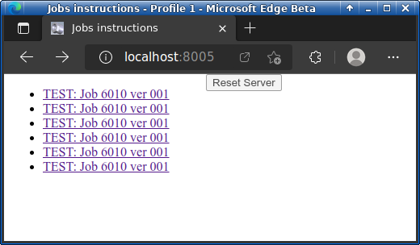
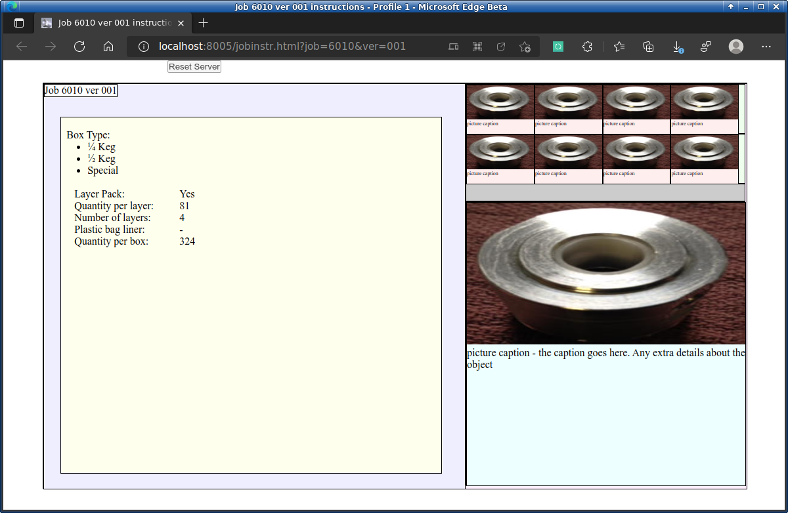

# Work_Instruction_Server
A NodeJS web server / framework for serving files traditionally, with NodeJS server reset button on the front-end for rapid testing.

To use this, run...

./nodereload.bash server.js

Then navigate to http://localhost:8005

You'll see this...

which links to this...

# ============================================

Background - this is a system where templates are hydrated in order to provide a list of instructions for a given group of parts.  The folder structure determines the contents of each item on the list.

The project can reload both the front-end page and the nodejs back-end server both at the same time.  By pressing the [reset] button at the top of the screen - very handy for testing.

This was originally designed in my spare time as a potential work instruction board for parts that my company makes.  They decided not to use it in favor of SolidWorks PDM - A commercial template-based product management software.  It was certainly a neat project to have worked on though.  It aschews the more modern "routes" way of doing web stuff in favor of the served out folder scheme.

The fact that this (which was created in 2016) still works today without any modification, speaks largely to the fact that it was written with no dependencies on external libraries or frameworks.  It's Vanilla Javascript.  It's not linked to any changing projects - so nothing to break it.  It's also written with the web standards in mind as a design consideration.

